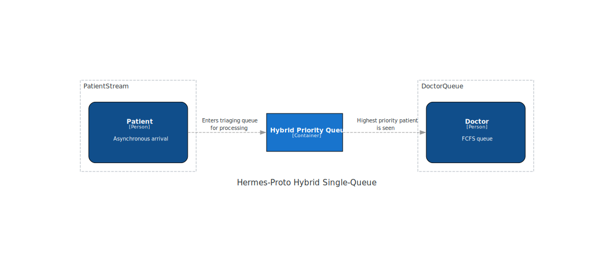
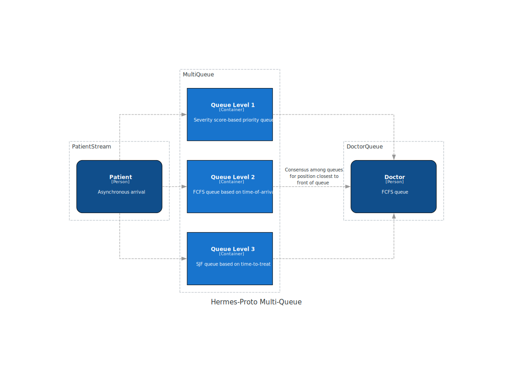

# `hermes-proto` Architecture

```
Author: John Lin @john-s-lin
Date Created: 2024-04-09
```

## Introduction

This document details the architectural design of a monolithic triaging engine as a clinical tool for improving patient wait times in the emergency department. It encompasses representations of doctors and patients as "entities" connected through one or more priority queues. Here, we'll explore different implementations of a triaging queue in the hopes of arriving at a more performant triaging paradigm.

The prototype will be implemented in [Rust](https://www.rust-lang.org/).

## Glossary

| Term    | Definition                                      |
| ------- | ----------------------------------------------- |
| CTAS    | Canadian Triage and Acuity Scale                |
| FCFS    | First-come first-serve                          |
| Process | An operating systems term for a running program |
| SJF     | Shortest job first                              |

## Background

In any typical software engineering/computer science degree, one course is usually dedicated to operating systems (OS). In this course, students are first introduced to CPU scheduling algorithms, such as first-come first-serve (FCFS), shortest job first (SJF), round robin (RR) and more. These algorithms serve as an inspiration to this prototype as a next-generation triaging engine. Instead of categorizing incoming patients using perceived severity alone, such as the 5-level [CTAS](https://caep.ca/wp-content/uploads/2017/06/module_1_slides_v2.5_2012.pdf) used in Canada, we will explore using a multimodal approach to triaging patients based on factors such as arrival time, time-to-treat, as well as estimated severity (like in CTAS).

## Requirements

- The number of doctors is predetermined before a "shift".
  - This can be implemented as a predefined command line argument at setup time.
- Patients arrive asynchronously at the ER
  - Patients would arrive as a streaming entity
- A patient entity should contain components for
  - severity
  - time of arrival
  - time to treat
- A doctor entity should contain components for
  - interaction time
  - burnout rate
    - arbitrary value, can be a constant or exponential as interaction time increases. For simplicity, will assume linear burnout rate
  - efficiency
    - Unlike CPUs, doctors cannot operate at 100% efficiency at all times.
    - Assume that burnout rate chips away at efficiency
- The triage scheduler can be a multi-level queue or a combined hybrid priority queue
  - A multi-level queue would require 3 queues
    - high-priority
    - FCFS
    - SJF
  - A single priority queue takes a hybrid metric from severity, time of arrival, and time-to-treat to determine a position score
    - This prototype will have arbitrary multiplier "weights"
- If the time of arrival increases, patient severity score should also increase to minimize absolute wait time
  - The determination of this will be arbitrary in this prototype

## High-Level Design



### PatientStream

Patients should arrive asynchronously in a stream.

### Hybrid Priority Queue

The triaging queue should be a single priority queue/heap ordered by a custom position score calculated from severity, time-of-arrival (total wait time), and estimated time-to-treat.

### DoctorQueue

Number of doctors are predetermined prior to "shift" and take the first available patient in the queue. We will assume all doctors are generalists.

## Detailed Design

> Note: representations will be done in `Python` since it is most like pseudocode. As stated above, the implementation will be done in `Rust`.

### 1. PatientStream

A patient is "streamed" into the system asynchronously, at any point in time starting from `t = 0`.

A patient can be simply represented as composed of `severity_score`, `time_of_arrival` and estimated `time_to_treat`.

`severity_score` is most analogous to the current triage paradigm, where chief complaints and past patient history lead to categorization into a discrete triage group. Here we will use a score that is more fine-grained. In this prototype, severity score will be procedurally generated.

`time_of_arrival` should be a `datetime.datetime` component, since we can then calculate total time spent waiting. `datetime.time` is not a good measure since rollover from `11:59:59` is `00:00:00`. For simplicity's sake, we will use an unsigned integer and measure time of arrival as time since start of epoch at `t = 0`. If wait-time increases, then `severity_score` should be increased such that patients that wait longer can be seen sooner.

`time_to_treat` should be an integer component, represented as minutes. Time-to-treat represents an estimated time to treat a patient once a doctor is seen, whether it be as an admittance as a hospital in-patient or a discharge. In this prototype, time-to-treat will be procedurally generated but will be no less than 15 minutes.

```python
class Patient:
    def __init__(self):
        self.severity_score: int = 0
        self.time_of_arrival: int = 0
        self.time_waited: int = 0
        self.time_to_treat: int = 0

    def calculate_time_waited(self):
        self.time_waited = current_time_since_epoch - time_of_arrival
```

### 2. Hybrid Priority Queue

The hybrid priority queue uses a combined metric for `position_score` which takes a weighted sum of all metrics in a `Patient` class. At this moment, this weighted sum consists of arbitrary coefficients.

```python
class HybridTriageQueue:
    def __init__(self):
        self.master_queue = heap.heapq()

    def calculate_patient_queue_position_score(self, patient: Patient):
        severity_coeff = 0.5
        arrival_time_ratio = 0.3
        encounter_duration_ratio = 0.2

        return (
            patient.severity_score * severity ratio +
            patient.time_waited * arrival_time_ratio +
            patient.time_to_treat * encounter_duration_ratio
        )
```

### 3. DoctorQueue

Finally, we'll need a Doctor class that ingests patients from the queue, and randomizes actual treatment time with an arbitrary error value of +/- 20%. Like in multi-core CPU architectures, multiple tasks can be parallelized in different cores, likewise there are usually >1 doctors active in the ER at any point in time.

It might be good to also implement a self-reported `burnout_rate = [0.0, 1.0)` and likewise an `efficiency` metric so that interaction time is a function of `efficiency * (patient.time_to_treat * (1 + error_rate within +/- 0.2))`. In this way, we model doctor efficiency and consequently interaction time as a function of burnout rate, such that doctors that work longer will become less efficient over time. Burnout rate can be linearly modeled such that after every patient encounter,

```python
new_efficiency = efficiency - burnout_rate
```

Another implementation for burnout rate can be exponential decay such that early instances do not deplete doctor efficiency as quickly in the beginning, but the efficiency rapidly degrades over time.

```python
new_efficiency = efficiency * (1 - burnout_rate)
```

This results in a deterministic function where $$\text{efficiency} = (1-\text{(burnout rate)})^\text{(encounters since epoch)}$$

With this in mind, incorporating some sort of "refractory" or "rest" period may be helpful to "restore" doctor efficiency, such that efficiency is not depleted to 0 over the course of a shift.

```python
class Doctor:
    def __init__(self):
        self.interaction_time = 0
        self.burnout_rate = 0.02 # Randomly assigned, will have to be calculated
        self.efficiency = 1 # Assume they start out at 1, then adjusts every case by self.efficiency - burnout_rate

    def update_efficiency(self):
        """Linear implementation"""
        self.efficiency -= self.burnout_rate
```

## Alternatives Considered



We considered using a multi-level queue scheduler, with separate queues representing severity (priority), time-of-arrival (FCFS), and time-to-treat (SJF). The order of patients to be served would be determined by majority consensus in all three queues so that patients with the collective lowest rank get seen first. This comes with a few drawbacks:

1. This requires storing 3x as much memory as a single queue, since the program will have to maintain three queues of total size `O(3n)` compared to the hybrid queue described above, which is only of size `O(n)`.
2. To perform a consensus vote on the foremost positions of each queue require re-sorting each queue each time a new patient is enrolled from the PatientStream, which is an `O(nlogn)` operation for each queue. Removal from each queue therefore cannot count on a patient to necessarily be the first element in each queue, even if they are the consensus vote, so the amortized time complexity for removal is `O(n)`. On the other hand, a single priority queue is `O(1)` peek for a first-position element and a `O(logn)` heapify action, and a `O(logn)` insertion when a patient is enrolled from the PatientStream.

## Limitations and Future Work

This prototype makes a ton of assumptions on how "things should be" and is a very simple model that is easy to represent as systems and components.

Other health professionals such as nurses are not modeled. Neither are hospital resources such as beds, imaging, laboratory work and more. Adding these entities to this prototype would massively increase the system's complexity. However, in a future implementation this will be addressed.

### Machine Learning

Implementing machine learning is a massive undertaking. Possible targets include:

- `patient.severity_score`
  - This is a diagnostics problem and will require data collection on symptoms and chief complaints
- `patient.time_to_treat`
  - This is also a diagnostics problem based on previous instances of a similar symptom manifestation and chief complaint
  - Suggests a regression problem based on previous similar patient encounters.
- `doctor.burnout_rate`
  - This would probably be an indirect measure based on self-reports by doctors pre-/post-shift on "personal efficacy". Not a good target.

> Caveat: using ML to assign doctors to patients would probably be ill-advised. "Faster" doctors may be preferred by the queue algorithm and assigned more often. This is task-dependent, however. If we don't rank doctors and assume a simple FCFS doctor queue, this will be a non-issue.

## References

> Note: some references are directly linked to their source above.

- CPU scheduling algorithms: https://www.geeksforgeeks.org/cpu-scheduling-in-operating-systems/
